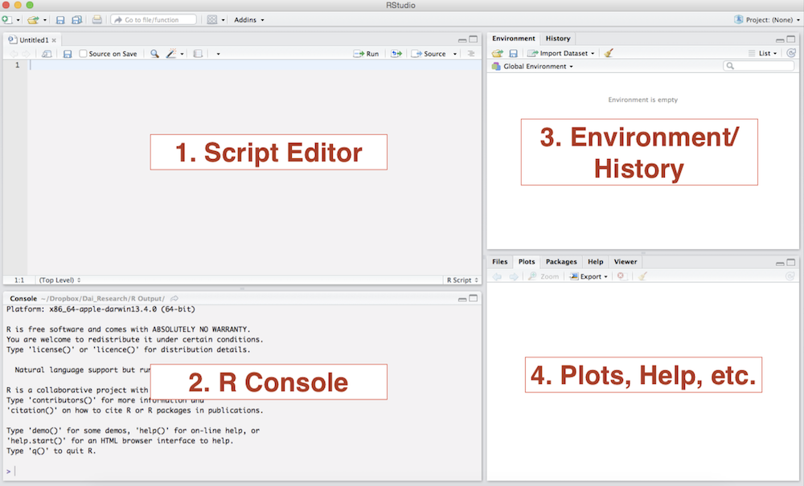
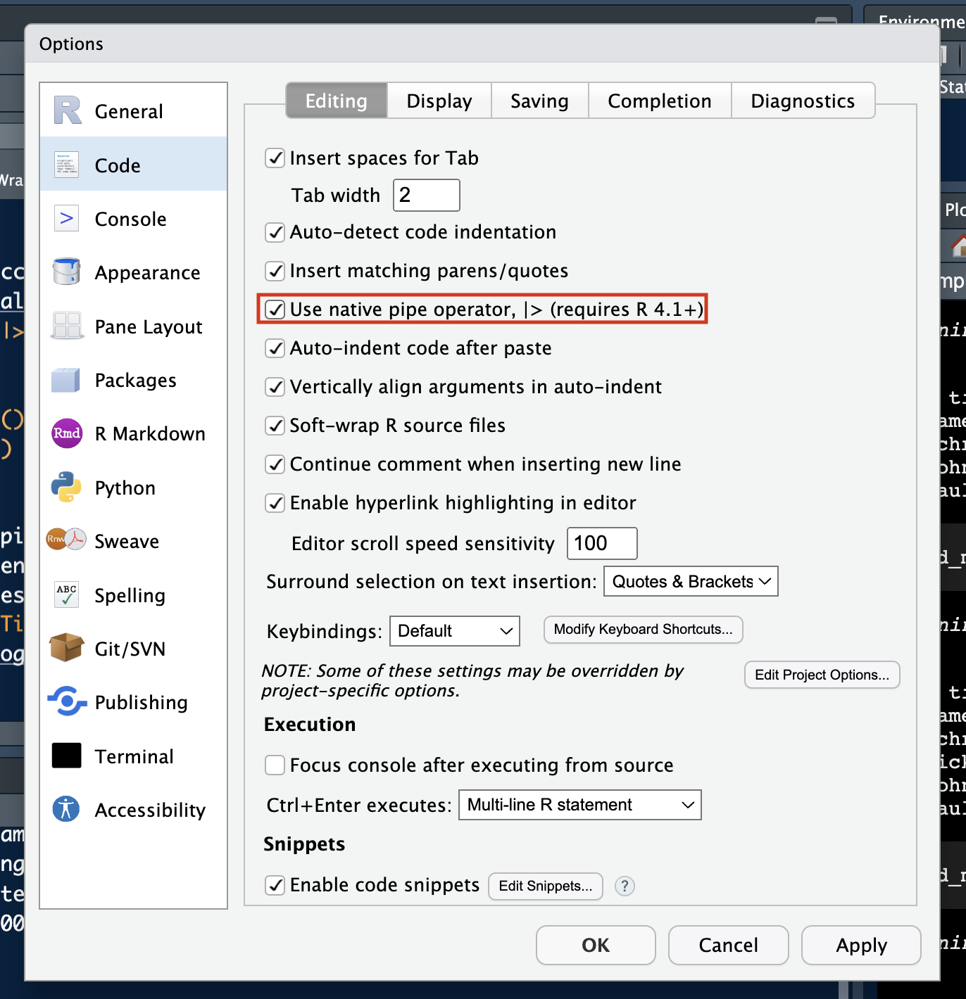

```{=html}
<style>
.h1,h2,h3 {
color:#2f1a61;
}

.subtitle, section.normal {
color:#291854;
}

.title {
color:#cc0065;
}
</style>
```

```{r setup, include=FALSE}
knitr::opts_chunk$set(echo = TRUE, message = FALSE, warning = FALSE)
```

## Welcome! `r emo::ji("wave")`

Welcome to your first lab session of the **Introduction to Data Science** course! These are the practical component of the course and rely largely on the *R* programming language.

We are three tutors for these labs - Carol Sobral, Laia Domenech Burin, and Linus Hagemann. We are here to talk you through the lab each week and help you with any questions you may have.

As there is a variety of experience levels in the room, we will try to go at a pace that fits our schedule and suits as many of you as possible. If we go too fast or too slow, do let us know! And don't hesitate to ask any questions - these labs are first and foremost for you! We also hold [office-hours](https://github.com/intro-to-data-science-26/labs).

This week's lab will be divided in three parts. 

- First, we will *recap* R/tidyverse basics.
- Second, we will talk about version control with `git`/GitHub (and how to turn in your assignments!).
- Third, we will discuss some best practices in R.

But first things first:

**Have you all successfully installed R, RStudio and git?**
Otherwise, install R, RStudio and git following our [setup guide](https://github.com/linusha/R-bootcamp-summer-2026/blob/main/IDS_Software_Setup.pdf) - or think about [updating](https://happygitwithr.com/install-r-rstudio.html) R, RStudio, and your installed packages. 

**Have you all registered a free GitHub account?**
Otherwise, register [here](https://github.com/).

**Are you part of the IDS '26 organization on GitHub?**
Otherwise, tell us.

**Which moodle courses for IDS can you see?**

---

# Working with R

## The RStudio interface

*RStudio* is an integrated development environment (IDE) for R. Think of *RStudio* as a front that allows us to write, compile, and work with R code in a comfortable way. The following image shows what the standard RStudio interface looks like:



1. **Console**: The *console* provides a means to interact directly with *R*. You can type some code at the *console* and when you press ENTER, R will run that code. Depending on what you type, you may see some output in the *console* or if you make a mistake, you may get a warning or an error message.

2. **Script editor**: You will utilize the *script editor* to complete your assignments. The *script editor* will be the space where files will be displayed. For example, once you download and open the bi-weekly assignment `.Rmd` template, it will appear here. The editor is a where you should write code you care about, since the code from the console cannot be saved into a script.

3. **Environment**: This area holds the variables you have created with your code. If you run `myresult <- 5+3+2`, the `myresult` object will appear there.

4. **Plots and files**: This area will be where graphic output will be generated. Additionally, if you write a question mark before any function, (i.e. `?mean`) the online documentation will be displayed here.

---

## Getting Help `r emo::ji("search")`

The key to learning R is: **Google**! We can give you an overview over basic R functions, but to really learn R you will have to actively use it yourself, trouble shoot, ask questions, and google! Help pages such as http://stackoverflow.com offer a rich archive of questions and answers by the R community. For example, if you google "recode data in r" you will find a variety of useful websites explaining how to do this on the first page of the search results. Don't be surprised if you find a variety of different ways to execute the same task.

RStudio also has a useful help menu. In addition, you can get information on any function or integrated data set in R through the console, for example:

```
?plot
```

In addition, there are a lot of free R comprehensive guides, such as Quick-R at http://www.statmethods.net or the R cookbook at http://www.cookbook-r.com.

You are also surrounded by a wealth of knowledge in your classmates around you. Feel free to collaborate or ask your neighbors questions to help you!

We recommend you **avoid using ChatGPT or any other AI tools for coding help in these labs!!** The point of these labs is to learn how to code yourself, so make sure you always try each task yourself first, and that you understand each line of code. If you have copilot enabled in your RStudio, please disable it for these labs.

## Executing a line of code

To execute a single line of code. In RStudio, with the cursor in the line you want R to execute, 

Press `command + return` (on macOS) or `Crtl + Enter` (on Windows).

To execute multiple lines of code at once, highlight the respective portion of the code and then run it using the operations above.

## Objects in R`r emo::ji("package")`

R stores information as an *object*, we might also call that a *variable*. You can name objects (nearly) whatever you like. 

A few things to remember though:

* Do not to use names that are reserved for built-in functions or functions in the packages you use, such as `sum`, `mean`, or `abs`. Most of the time, R will let you use these as names, but it leads to confusing code. 
* Do not use spaces or special characters such as `$` or `%`. Common symbols that are used in variable names include `.` or `_`. 
* Remember that R is case sensitive.
* To assign values to objects, we use the assignment operator `<-`. Sometimes you will also see `=` as the assignment operator. This is a matter of preference and subject to debate among R programmers.
* The `#` symbol is used for commenting and demarcation. Any code following `#` will not be executed.

### Data Types in R

There are four main variable types you should be familiar with:

* **Numerical**: Any number. An **integer** is a numerical variable *without* any decimals, while a **double** is a numerical variable *with* decimals.
* **Character**: This is what Stata (and other programming languages such as Python) calls a string. We typically store any alphanumeric data that is not ordered as a character *vector.*
* **Logical**: Either `TRUE` or `FALSE`, commonly known as a boolean in other programming languages.
* **Factor**: Think about it as an ordinal variable, i.e. an ordered categorical variable, such as the options of a likert-scale item in a survey.


### Data Structures in R

R has many data structures, the most important ones for now are:

* **Vectors**: The most basic data structure in R; a sequence of elements of the same type.
* **Factors**: Special vectors used to store categorical data with fixed possible values (levels).
* **Lists**: A collection that can hold elements of different types, including other data structures.  
* **Matrices**: A two-dimensional structure where all elements must be of the same type.  
* **Data frames**: A table-like structure where each column can be of a different type, often used for datasets. *This is the one we will work with the most*.

---

## R Packages `r emo::ji("folder")`

For the most part, *R Packages* are collections of code and functions that leverage R programming to expand on the basic functionalities. There are a plethora of packages in *R* designed to facilitate the completion of tasks, built by the R community. You already know one important package (or rather a collection of packages): **the tidyverse**.

With *R* you usually only need to install a package once. The following times you will only need to load the package. You can install a package with the following syntax

```r
install.packages("name_of_your_package") # note that the quotation marks are mandatory at this stage
```

Once the package has been installed, you just need to "call it" every time you want to use it in a file by running:

```r
library("name_of_your_package") # either of this lines will require the package
library(name_of_your_package) # library understands the code with, or without, quotation marks
```

**It is extremely important that you do not have any lines installing packages in your assignments because the file will fail to knit**

---

### R File types

There are two main file types you will be working with in this course: `.R` files and `.Rmd` files. The former are simply scripts of R code, while the latter are R Markdown files that allow you to combine text and code in a single document. You can "knit" R markdown files to produce outputs in a variety of formats, including HTML, PDF, and Word. This whole lab is just a fancy `.Rmd` file!

---

# Version Control with  Git and GitHub (Condensed Version)

Why should you care about git?

1. You need it to hand in your assignments ;)
2. It allows you to easily collaborate on code- which you will need later in this semester and your future courses and work
3. With git, you ideally get a reason for every change you or other people made to your code - future you will thank you!
4. git allows you to easily revert to previous versions of your code, which is a lifesaver when you make a mistake or want to try out something new without losing your original code.

This is mainly a condensed version of the version control extra session, which can be found in full [here](https://raw.githack.com/intro-to-data-science-26/labs/main/00_version-control/0-git.html).

We recommend you to learn git on the command line first and foremost. Being comfortable with "pure" git is the best way to actually understand the underlying concepts, which will allow you to use any tool on top later one. If the command line is absolutely not your cup of tea, the second recommendation is RStudio's git integration. There are also a myriad of different GUIs that you can try out and play around with on your own.

---

## Suggested Workflow `r emo::ji("surfer")`

This is the recommended workflow that you should employ when you work with Git. You can see it as a sort of recipe that you should follow under most circumstances. At each stage you can find the instructions for working through both the Command Line and through RStudio.

### 1. Create a new repo on GitHub

-   Go to [your github page](https://github.com) and make sure you are logged in.

-   Click green "New repository" button. Or, if you are on your own profile page, click on "Repositories", then click the green "New" button.

-   How to fill this in:

    -   Repository name: my_first_repo (or whatever you want).
    -   Description: "figuring out how this works" (or whatever, but some text is good for the README).
    -   Select Public.
    -   YES Initialize this repository with a README.
    -   For everything else, just accept the default.

Great, now that you have created a new repo on GitHub, it is important to note that you **should always** create a repo **prior** to starting your work in RStudio.


### 2. Clone it to your local machine {.tabset}

Whatever way you plan on cloning this repo, you first need to copy the URL identifying it. Luckily there is another green button "Code" that allows you to do just that. Copy the HTTPS link for now. It will look something like this <https://github.com/your-git-username/my_first_repo.git>.

#### Using Rstudio

In RStudio, go to:

File \> New Project \> Version Control \> Git.

In the "repository URL"-box paste the URL of your new GitHub repository.

Do not just create some random directory for the local copy. Instead think about how you organize your files and folders and make it coherent.

I always suggest that with any new R-project you "Open in new session".

Finally, click the "Create Project" to create a new directory. What you get are three things in one:

-   a directory or "folder" on your computer
-   a Git repository, linked to a remote GitHub repository
-   an RStudio Project

In the absence of other constraints, we suggest that all of your R projects have exactly this set-up.


#### Using the Command Line

Open the Terminal on your laptop.

Be sure to check what directory you're in. `$ pwd` displays the working directory. `$ cd` is the command to change directory.

Clone a repo into your chosen directory.

```{bash, eval=F}
cd ~/teaching/2024-ids 
git clone https://github.com/your-git-username/my_first_repo.git

```

Check whether it worked:

```{bash, eval=F}
cd ~/teaching/2024-ids/my_first_repo
git log
git status
```

###  {.unlisted .unnumbered}


### 3. Make changes to a file {#code}


###  {.unlisted .unnumbered}


### 4. Stage your Changes and Commit {.tabset}

Now that you made some changes locally, we need to let Git know.

#### Using RStudio

In the Environment/History panel a new tab called "git" should have appeared.

-   Click on it and it should display all the changed and new files in your directory.
-   Now you can select which files you want to stage. Simply tick the box next to your chosen files.
-   Hit the Commit Button and a new window should open up.
-   In this window you can quickly add a helpful message to mark exactly what you did. (Do not neglect this, as Git won't allow you to commit without it. Plus, a clear message will help both you and your collaborators to understand your changes.)

This method has the clear advantage of being extremely intuitive. However you are limited to selecting and staging individual files.


#### Using the Command Line

Stage ("add") a file or group of files. This allows you to stage specific individual files such as the README file for example.

```{bash, eval=F}
git add NAME-OF-FILE-OR-FOLDER
```

Alternatively, you could stage all files (whether updated or not):

```{bash, eval=F}
git add -A
```

Or you could stage updated files only (modified or deleted, but not new):

```{bash, eval=F}
git add -u
```

Finally, you can also only stage new files (not updated ones).

```{bash, eval=F}
git add .
```

Having done so, you are now ready to commit these changes!

```{bash, eval=F}
git commit -m "Helpful message"

```

As you can imagine, the command shell with its different options (and there are more beyond the staging phase), can be quicker and more flexible than your GUI interface, especially for experienced users.

###  {.unlisted .unnumbered}


### 5. Pulling and Pushing your commits {.tabset}

This part of the version control workflow should be relatively easy. The most important thing to remember is that you should always **pull** before you **push**. The reason for this is that in collaborative projects someone else might have pushed changes to the same file you were working on. This can lead to conflicts that should be avoided, if possible.


#### Using RStudio

In RStudio you should see a change in the **git** tab. It should now read: "Your branch is ahead of 'origin/main' by 1 commit"

As long as this information is displayed, you know that you need to pull and push your commit.

To do this simply click on the blue arrow pointing down to **pull** from your main repo, before clicking on the green arrow pointing upwards to **push** your commits.


#### Using the Command Line

There are only two commands you need to remember here and they are pretty intuitive:

To pull from the main repo:

```{bash, eval=F}
git pull
```

And to push your commits:

```{bash, eval=F}
git push
```

### Authenticating to GitHub

Even a public repository is **your** repository first and foremost. That means that not just anyone can push changes to it. Hence, you need to authenticate to GitHub that you are allowed to push to a repository with your username and something called a PAT (which is essentially a password, but not exactly). The easiest way to do this is by using the `usethis` package:

```{r, eval=FALSE}
# install.packages("usethis")
library(usethis)
usethis::create_github_token() # SAVE THIS TOKEN!
gitcreds::gitcreds_set() # or enter your PAT each time you are prompted
```

You can read more on this [here](https://usethis.r-lib.org/articles/git-credentials.html).

------------------------------------------------------------------------

## Practice Assignment Setup

We'll be using GitHub for the assignments. Let's take a look at the [practice assignment](https://classroom50.org/intro-to-data-science-26/ids/assignments/assignment-0/accept?k=h3rti3mds) to get familiar with the workflow.

# Revision of R... `r emo::ji("penguin")`

We will use penguins data, that some of you are probably already familiar with. Handily, this data is contained in a package called `palmerpenguins`. To make the `palmerpenguins` package available for use, install it and then use the `library()` command to load it. While packages need to be installed only once, the `library()` command needs to be run every time you want to use a particular package.

```{r, warning = F}
# install.packages("palmerpenguins") # Run this in console only
library(palmerpenguins)
```

### Loading the data

Once we have loaded the package we can load the data set by simply typing `data(penguins)`. The data will be stored in a data frame called `penguins`. (Note: Usually, you would load data from a file on your computer or from a URL as most datasets are not packaged.)
 
```{r}
data(penguins)
```

## Data Frame Structure
Let's find out what these data look like. First, we can print out the data frame to the console. If we just type the name of the data frame, R will print out the first 10 rows and all columns of the data frame.
```{r}
print(penguins)
```


:::alert-info
**Exercise 1**
Look at the output from the function above. How many observations (rows) and variables (columns) does the penguins dataset have? What different data types do you see?
:::

If we are only interested in what the variables are called, we can use the `names()` function.

```{r}
names(penguins)
```

We can use the `summary()` function to get a first look at the data.
```{r}
summary(penguins)
```

A data frame has two dimensions: rows and columns. 
```{r}
nrow(penguins) # Number of rows
ncol(penguins) # Number of columns
dim(penguins) # Rows first then columns.
```

### Accessing elements of a data frame - Indexing
As a rule, whenever we access a dataframe or another object using two-dimensional indexing in R, the order is: `[row, column]`. To access the first row of the data frame, we specify the row we want to see and leave the column slot following the comma empty.
```{r}
penguins[1, ]
```

We can use the concatenate function `c()` to access multiple rows (or columns) at once. Below we print out the first and second row of the dataframe.
```{r}
penguins[c(1, 2), ]
```

We can also access a range of rows by separating the minimum and maximum value with a `:`. Below we print out the first five rows of the dataframe. 
```{r}
penguins[1:5,]
```

If we try to access a data point that is out of bounds, R returns an error. 
```{r}
#penguins[3,10]
```

:::alert-info
**Exercise 2**

Access the species information (column 1) for the 10th penguin in the dataset using indexing.
:::

```{r, echo=F}

```

:::alert-info
**Exercise 3**

Access rows 15 through 20 and columns 1 through 3 of the penguins dataset.
:::
```{r, echo=F}

```

### The `$` operator

The `$` operator in R is used to specify a variable within a data frame. This is an alternative to indexing. All the following commands will return essentially the same output: the species of all penguins in the dataset.
```{r}
which(colnames(penguins) == "species")

penguins[,'species']
penguins[,1]
penguins$species
```

### `table()` function

The `table()` function can be used to tabularize one or more variables. For example, let's find out how many observations (i.e. individual penguins) we have per species.

```{r}
table(penguins$species)
```

Using logical operations, we can create more complex tabularizations. For example, below, we show how many penguins have above average body mass per species.

```{r}
summary(penguins$body_mass_g)
table(penguins$species, penguins$body_mass_g > mean(penguins$body_mass_g, na.rm = TRUE))
```

:::alert-info
**Exercise 4**

Create a table showing the distribution of penguin sex by species. What do you notice about the missing values?
:::

```{r, echo=F}

```

## NAs in R
`NA` is how R denotes missing values. For certain functions, `NA`s cause problems.
```{r}
vec <- c(4, 1, 2, NA, 3)
mean(vec) #Result is NA!
sum(vec) #Result is NA!
```

We can tell R to remove the NA and execute the function on the remainder of the data.
```{r}
mean(vec, na.rm = T)
sum(vec, na.rm = T)
```

## Dealing with errors in R

Errors in R occur when code is used in a way that it is not intended. For example when you try to add two character strings, you will get the following error:

```r
"hello" + "world"
Error in "hello" + "world": non-numeric argument to binary operator
```

Normally, when something has gone wrong with your program, *R* will notify you of an error in the **console**. There are errors that will prevent the code from running, while others will only produce **warning** messages. In the following case, the code will run, but you will notice that the string **"three"** is turned into a NA.

```r
as.numeric(c("1", "2", "three"))
Warning: NAs introduced by coercion
[1]  1  2 NA
```

Since we will be utilizing widely used packages and functions in the course of the semester, the errors that you may come across in the process of completing your assignments will be common for other R users. Most errors occur because of typos. A Google search of the error message can take you a long way as well. Most of the times the first entry on **[stackoverflow.com](https://stackoverflow.com/)** will solve the problem.   

---

# ...and the tidyverse `r emo::ji("sparkles")`

```{r}
library(tidyverse)
```

Now, let us leave base R behind and make our lives much easier by introducing you to the tidyverse. We think for data cleaning, wrangling, and plotting, the tidyverse really is a no-brainer. A few good reasons for teaching the tidyverse are:

-   Outstanding documentation and community support
-   Consistent philosophy and syntax
-   Convenient "front-end" for more advanced methods

Read more on this [here](http://varianceexplained.org/r/teach-tidyverse/) if you like.

**But**... this certainly shouldn't put you off learning base R alternatives.

-   Base R is extremely flexible and powerful (and stable).
-   There are some things that you'll have to venture outside of the tidyverse for.
-   A combination of tidyverse and base R is often the best solution to a problem.
-   Excellent base R data manipulation tutorial [here](https://github.com/matloff/fasteR).

## Tidyverse packages

Why is it called the tidy*verse*? Well, as we saw above when we loaded the `tidyverse` package, it actually loaded a number of packages (which could also be loaded individually): **ggplot2**, **tibble**, **dplyr**, etc.

The tidyverse actually comes with a lot more packages than those that are just loaded automatically.

```{r}
tidyverse_packages()
```

We'll use several of these additional packages during the remainder of this course.

Underlying these packages are two key ideas:

------------------------------------------------------------------------

## The pipe `%>%` operator

You might have seen the pipe operator in the past.

### The beauty of pipes {.tabset}

-   The forward-pipe operator `%>%` pipes the left-hand side values forward into expressions on the right-hand side.
-   It serves the natural way of reading ("do this, then this, then this, ...").
-   We replace `f(x)` with `x %>% f()`.
-   It avoids nested function calls.
-   It minimizes the need for local variables and function definitions.

#### The classic way

```{r, eval = FALSE}
hertie(
  bvg(
    walk(
      breakfast(
        shower(
          wake_up(
            Alex, 7
          ),
          temp = 38
        ),
        c("coffee", "croissant")
      ),
      step_function()
    ),
    train = "U2",
    destination = "Stadtmitte"
  ),
  course = "Intro to DS"
)
```

#### The classic way, nightmare edition

```{r, eval = FALSE}
alex_awake <- wake_up(Alex, 7)
alex_showered <- shower(alex_awake, 
                        temp = 38)
alex_replete <- breakfast(alex_showered, 
                          c("coffee", "croissant"))
alex_underway <- walk(alex_replete, 
                      step_function())
alex_on_train <- bvg(alex_underway, 
                     train = "U2", 
                     destination = "Stadtmitte")
alex_hertie <- hertie(alex_on_train, 
                      course = "Intro to DS")
```

#### The pipe way

```{r, eval = FALSE}
Alex %>%
  wake_up(7) %>%
  shower(temp = 38) %>%
  breakfast(c("coffee", "croissant")) %>%
  walk(step_function()) %>%
  bvg(
    train = "U2",
    destination = "Stadtmitte"
  ) %>%
  hertie(course = "Intro to DS")
```

### Piping etiquette

-   Pipes are not very handy when you need to manipulate **more than one object** at a time. Reserve pipes for a sequence of steps applied to one primary object.
-   Don't use the pipe when there are **meaningful intermediate objects** that can be given informative names (and that are used later on).
-   `%>%` should always have a space before it, and should usually be followed by a new line.

## The base R pipe: `|>`

The `magrittr` pipe has proven so successful and popular that the R core team [recently added](https://stat.ethz.ch/R-manual/R-devel/library/base/html/pipeOp.html) a "native" pipe operator to base R (version 4.1), denoted `|>`. Here's how it works:

``` r
mtcars |> subset(cyl == 4) |> head()
mtcars |> subset(cyl == 4) |> (\(x) lm(mpg ~ disp, data = x))()
```

Now, should we use the `magrittr` pipe or the native pipe? The native pipe might make more sense in the long term, since it avoids dependencies and might be more efficient. Check out [this Stackoverflow post](https://stackoverflow.com/questions/67633022/what-are-the-differences-between-rs-new-native-pipe-and-the-magrittr-pipe) and [this Tidyverse blog post](https://www.tidyverse.org/blog/2023/04/base-vs-magrittr-pipe/) for a discussion of differences.

You can update your settings, if you'd like RStudio to default to the native pipe operator `|>`.

```{r, echo=FALSE, fig.align='center', out.width="70%"}

```

------------------------------------------------------------------------

## Tidy Data

Generally, we will encounter data in a tidy format. Tidy data refers to a way of mapping the structure of a data set. In a tidy data set:

1.  Each variable forms a column.
2.  Each observation forms a row.
3.  Each type of observational unit forms a table

```{r, fig.align='center', echo=F, out.width = "70%"}
knitr::include_graphics("pics/tidy_data.png")
```

------------------------------------------------------------------------

# Data manipulation with `dplyr`

A second fundamental package of the tidyverse is called `dplyr`. In this section you'll learn and practice examples using some functions in `dplyr` to work with data. Those are:

-   `dplyr::select()`: Select (i.e. subset) columns by their names (keep or exclude some columns)
-   `dplyr::filter()`: Filter (i.e. subset) rows based on their values (keep rows that satisfy your conditions)
-   `dplyr::mutate()`: Create new columns or edit existing ones
-   `dplyr::group_by()`: Define groups within your data set
-   `dplyr::summarize()`: Collapse multiple rows into a single summary value (summary statistics)
-   `dplyr::arrange()`: Arrange (i.e. reorder) rows based on their values (reorder rows according to single or multiple variables)

To demonstrate and practice how these verbs (functions) work, we'll use the penguins dataset we saw earlier.

------------------------------------------------------------------------

## `dplyr::select()`

The first verb (function) we will utilize is `dplyr::select()`. We can employ it to manipulate our data based on **columns**. If you recall from our initial exploration of the data set there were eight variables attached to every observation. Do you recall them? If you do not, there is no problem. You can utilize `names()` to retrieve the names of the variables in a data frame.

```{r}
names(penguins)
```

Say we are only interested in the species, island, and year variables of these data, we can utilize the following syntax:

`dplyr::select(data, columns)`


:::alert-info
**Exercise 1**

The following code chunk would select the variables we need. Can you adapt it, so that we keep the body_mass_g and sex variables as well?
:::

```{r,, eval=F}
dplyr::select(penguins, species, island, year)
```

Good to know: To **drop** variables, use `-` before the variable name, i.e. select(penguins, -year) to drop the year column (select everything but the year column).

------------------------------------------------------------------------

## `dplyr::filter()` `r emo::ji("coffee")`

The second verb (function) we will employ is `dplyr::filter()`. `dplyr::filter()` lets you use a logical test to extract specific **rows** from a data frame. To use `dplyr::filter()`, pass it the data frame followed by one or more logical tests. `dplyr::filter()` will return every row that passes each logical test.

The more commonly used logical operators are:

-   `==`: Equal to
-   `!=`: Not equal to
-   `>`, `>=`: Greater than, greater than or equal to
-   `<`, `<=`: Less than, less than or equal to
-   `&`, `|`: And, or

Say we are interested in retrieving the observations from the year 2007. We would do:

```{r , eval=F}
dplyr::filter(penguins, year == 2007)

# same as writing
# penguins %>% dplyr::filter(year == 2007)
```


:::alert-info
**Exercise 2**

We can leverage the pipe operator to sequence our code in a logical manner. Can you adapt the following code chunk with the pipe and conditional logical operators we discussed?
:::

```{r}
only_2009 <- dplyr::filter(penguins, year == 2009)
only_2009_chinstraps <- dplyr::filter(only_2009, species == "Chinstrap")
only_2009_chinstraps_species_sex_year <- dplyr::select(only_2009_chinstraps, species, sex, year)
final_df <- only_2009_chinstraps_species_sex_year
final_df #to print it in our console

```

------------------------------------------------------------------------

## `dplyr::mutate()` `r emo::ji("closed_umbrella")` `r emo::ji("open_umbrella")`

`dplyr::mutate()` lets us create, modify, and delete columns. The most common use for now will be to create new variables based on existing ones. Say we are working with a U.S. American client and they feel more comfortable with assessing the weight of the penguins in pounds. We would utilize `mutate()` as such:

```         
dplyr::mutate(new_var_name = manipulated old_var(s))
```

```{r,, eval=F}
penguins |>
  dplyr::mutate(body_mass_lbs = body_mass_g/453.6)
```

------------------------------------------------------------------------

## `dplyr::group_by()` and `dplyr::summarize()`

These two verbs `dplyr::group_by()` and `dplyr::summarize()` tend to go together. When combined , `dplyr::summarize()` will create a new data frame. It will have one (or more) rows for each combination of grouping variables; if there are no grouping variables, the output will have a single row summarizing all observations in the input. For example:

```{r}
# compare this output with the one below
penguins |>
  dplyr::summarize(heaviest_penguin = max(body_mass_g, na.rm = T)) 
```

```{r}
penguins |>
  dplyr::group_by(species) |>
  dplyr::summarize(heaviest_penguin = max(body_mass_g, na.rm = T)) |>
  dplyr::ungroup()
```

There is also an alternate approach to calculating grouped summary statistics called per-operation grouping. This allows you to define groups in a `.by` argument, passing them directly in the `summarize()` call. These groups don't persist in the output whereas the ones used with `group_by` do. You can read more about both these approaches in [R for Data Science, 2nd edition](https://r4ds.hadley.nz).

```{r}
penguins |>
  dplyr::summarise(heaviest_penguin = max(body_mass_g, na.rm = T), .by = species) |>
  dplyr::ungroup()

penguins |>
  dplyr::summarise(heaviest_penguin = max(body_mass_g, na.rm = T), .by = c(species, sex)) |>
  dplyr::ungroup()
```

> Notice that we are using `dplyr::ungroup()` after performing grouped calculations. It is a convention we encourage. If you forget to `ungroup()` data, future data management can produce errors in downstream operations. Just to be sage, use `dplyr::ungroup()` when you've finished with your calculations.


:::alert-info
**Exercise 3**
Can you get the weight of the lightest penguin of each species? You can use `min()`. What happens when in addition to species you also group by year `group_by(species, year)`?
:::

```{r,, eval=F}

```

------------------------------------------------------------------------

## `dplyr::arrange()` `r emo::ji("egg")` `r emo::ji("hatching_chick")` `r emo::ji("hatched_chick")`

The `dplyr::arrange()` verb is pretty self-explanatory. `dplyr::arrange()` orders the rows of a data frame by the values of selected columns in ascending order. You can use the `desc()` argument inside to arrange in descending order. The following chunk arranges the data frame based on the length of the penguins' bill. You hint tab contains the code for the descending order alternative.

```{r, eval=F}
penguins |>
  dplyr::arrange(bill_length_mm)

```

```{r, eval=F}
penguins |>
  dplyr::arrange(desc(bill_length_mm))

```


:::alert-info
**Exercise 4**
Can you create a data frame arranged by body_mass_g of the penguins observed in the "Dream" island?
:::

```{r,, eval=F}

```

------------------------------------------------------------------------

## Optional: Other `dplyr` functions

`dplyr::slice()`: Subset rows by position rather than filtering by values.

```{r eval=F}
penguins |> dplyr::slice(c(1, 5))
```

------------------------------------------------------------------------

`dplyr::pull()`: Extract a column from a data frame as a vector or scalar.

```{r eval=F}
penguins |> 
  dplyr::filter(sex == "female") |> 
  dplyr::pull(flipper_length_mm)
```

------------------------------------------------------------------------

`dplyr::count()` and `dplyr::distinct()`: Number and isolate unique observations.

```{r eval=F}
penguins |> dplyr::count(species)
penguins |> dplyr::distinct(species)
```

*Note:* You could also use a combination of `dplyr::mutate`, `dplyr::group_by`, and `n()`, e.g. `penguins |> dplyr::group_by(species) |> dplyr::summarize(num = n())`.

------------------------------------------------------------------------

`dplyr::where()`: Select the variables for which a function returns true.

```{r eval=F}
penguins |> dplyr::select(dplyr::where(is.numeric)) |> names()
```

------------------------------------------------------------------------

`dplyr::across()`: Summarize or mutate multiple variables in the same way. More information [here](https://dplyr.tidyverse.org/reference/across.html).

```{r eval=F}
penguins |> dplyr::mutate(dplyr::across(dplyr::where(is.numeric), scale)) |> head(3)
```

------------------------------------------------------------------------

`dplyr::case_when()`: Vectorize multiple `if_else()` (or base R `ifelse()`) statements.

```{r eval=F}
#multiple conditional statements
penguins |> 
  dplyr::mutate( 
    flipper_length_cat = 
      dplyr::case_when(
        flipper_length_mm < 190 ~ "small",
        flipper_length_mm >= 190 & flipper_length_mm < 210 ~ "medium",
        flipper_length_mm >= 210  ~ "large"
      )
  ) |>
  dplyr::pull(flipper_length_cat) |> table()
```

**Window functions**: There are also a whole class of [window functions](https://cran.r-project.org/web/packages/dplyr/vignettes/window-functions.html) for getting leads and lags, ranking, creating cumulative aggregates, etc. See `vignette("window-functions")`.


---

# Best practices

Let us conclude the tutorial with some notes on best practices in R.
There is a multitude of collections on best practices online, for example, some very useful ones are [here](https://www.r-bloggers.com/2018/09/r-code-best-practices/).

## Script structure

When structuring your scripts, remember a few things

* Libraries go first
* Hard coded variables (e.g. when reading in data) go second
* Relative paths over absolute paths (give your friends and colleagues a chance to execute your scripts without trouble)

## Naming conventions

Always use easy to interpret names and don’t use whitespace in file or variable names! Adhere to one naming scheme and don't mix languages.
Some *good* examples:

* `survey_data_2024.R`
* `student_ids <- c(101, 102, 103)`
* `calculate_gpa()`

## Spacing

It is somewhat easier to read if you generally leave a space after a comma

* `my_function(1:10, c(2, 4))`

## Repetition

When you start copying and pasting code (creating a lot of redundancy), you might want to consider slimming down your code by creating a function. Functions? Let us leave this as a note of caution and return to functions and efficient code in our next session!


## Actually learning R `r emo::ji("backpack")`

Again, the key to learning R is: **practice**! We can only give you an overview over basic R functions, but to really learn R you will have to actively use it yourself, trouble shoot, ask questions, and google! It is very likely that someone else has had the exact same or just *similar enough* issue before and that the R community has answered it with 5+ different solutions years ago. `r emo::ji("wink")`


See you next week! `r emo::ji("computer")`

---

# <b style="color:#2f1a61">Acknowledgements</b> {-}

This script was drafted by [Tom Arendt](https://github.com/tom-arend) and [Lisa Oswald](https://lfoswald.github.io/), with contributions by [Steve Kerr](https://smkerr.github.io/), [Hiba Ahmad](https://github.com/hiba-ahmad), [Carmen Garro](https://github.com/cgarroca), [Sebastian Ramirez-Ruiz](https://seramirezruiz.github.io/), [Killian Conyngham](https://github.com/Killian-Conyngham), [Carol Sobral](https://github.com/cbsobral), and [Linus Hagemann](https://linushagemann.de).

It draws heavily on the materials for the Introduction to R workshop within the Data Science Seminar series at Hertie, created by [Therese Anders](http://therese.rbind.io/), Statistical Modeling and Causal Inference by Sebastian Ramirez-Ruiz and Lisa Oswald.

Gorman KB, Williams TD, Fraser WR (2014). Ecological sexual dimorphism and environmental variability within a community of Antarctic penguins (genus Pygoscelis). PLoS ONE 9(3):e90081. https://doi.org/10.1371/journal.pone.0090081


