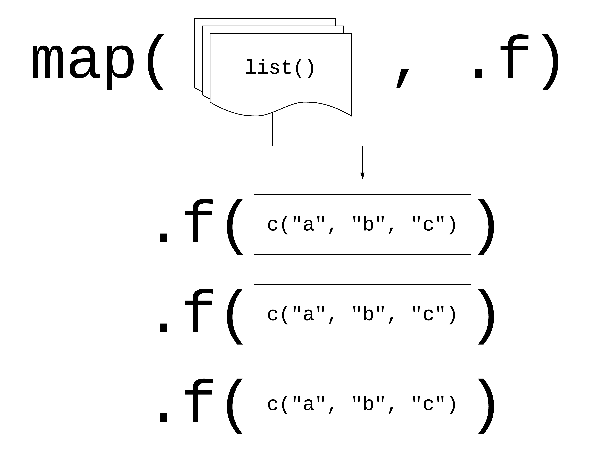

```{=html}
<style>
.h1,h2,h3 {
color:#2f1a61;
}

.subtitle, section.normal {
color:#291854;
}

.title {
color:#cc0065;
}

.nav-pills>li>a{
color: #2f1a61;
}

.nav-pills>li.active>a, .nav-pills>li.active>a:hover, .nav-pills>li.active>a:focus {
color: #fff;
background-color: #2f1a61;
}

.nav-tabs>li>a{
color: #2f1a61;
}

.nav-tabs>li.active>a, .nav-tabs>li.active>a:hover, .nav-tabs>li.active>a:focus {
color: #fff;
background-color: #2f1a61;
}

</style>
```

```{r setup, include=FALSE}
knitr::opts_chunk$set(echo = TRUE, message = FALSE, warning = FALSE)

library(tidyverse)
library(purrr)
```

# Quick review: `tidyverse` and `dplyr`

## Data manipulation with `dplyr`

A fundamental package of the tidyverse is called `dplyr`. Last class we briefly talked about them, but we are going to do a short review. The main `dplyr` functions are:

- `select()`: Select (i.e. subset) columns by their names (keep or exclude some columns)
- `filter()`: Filter (i.e. subset) rows based on their values (keep rows that satisfy your conditions)
- `mutate()`: Create new columns or edit existing ones
- `group_by()`: Define groups within your data set
- `summarize()`: Collapse multiple rows into a single summary value (summary statistics)
- `arrange()`: Arrange (i.e. reorder) rows based on their values (reorder rows according to single or multiple variables)

We are going to practice a short exercise with the `gapminder` dataset, which contains development data for various countries over time.

```{r}
library(gapminder)
head(gapminder) 
```

::: alert-info
**Review Exercise**

We can leverage the pipe operator to sequence our code in a logical manner. Can you adapt the following code chunk with the pipe and conditional logical operators we discussed previously?
:::

```{r}
only_2007 <- filter(gapminder, year == 2007)
only_2007_europe <- filter(only_2007, continent == "Europe")
only_2007_europe_country <- select(only_2007_europe, country, lifeExp, gdpPercap)
final_df <- only_2007_europe_country
final_df
```

Additionally, the `tidyverse` has functions to export and import data. We usually will work with data in csv format. The function to read those files is `read_csv`. It only requires to pass by the path of the file as a string, and store the function call in an R object so the dataframe is stored in the R environment.

The functions to export the file is [`write_csv`](https://readr.tidyverse.org/reference/write_delim.html). Its most important arguments are `x` and `file`, where you indicate the dataframe object you want to export and the path of the file respectively. Let's try them out! In the following block, export the created `final_df` dataframe as a csv and then try to import it.

```{r eval=FALSE, include=FALSE}
# Export the file: 

write_csv()

# Import the file: 

final_df_imported <- read_csv(x = ...,
                              file = ...)
```

# Functions with `R`

## Quick review: lists 📄

One of the more important objects in R for functional programming are lists. Since we only briefly touched upon them in Week 1, let's go over them again in more detail.

Vectors can only hold a single data type.

```{r}
vec <- c(a = "hello", b = 1)
```

By comparison lists can hold many different data types at the same time.

```{r}
list <- list(a = "hello", b = 1, c = mean)
```

When you think about it, data.frames are also lists (or rather a list of columns).

Lists are very useful when you start writing your own functions and iterating through them using the `purrr` family of functions.

------------------------------------------------------------------------

## Functions

In any coding language a fundamental principle should be **DRY** (**D**on't **R**epeat **Y**ourself). A good rule of thumb: once you've copy-pasted code twice, it's time to write a function.

Functions allow you to automate tasks in a more powerful and general way. Writing a function has three big advantages copy-and-pasting:

1.  As requirements change, you only need to update code in one place, instead of in many.

2.  You eliminate the chance of making incidental mistakes when you copy and paste (i.e. updating a variable name in one place, but not in another).

3.  You can give functions descriptive names that make your code easier to understand.

You can read more on functions in [this section](https://r4ds.hadley.nz/functions.html) of R for Data Science.

------------------------------------------------------------------------

## Basic Syntax

What kind of code calls for writing a function? Here's a typical example:

```{r, results=FALSE}
df <- data.frame(
  a = rnorm(100, 5, 2),
  b = rnorm(100, 100, 15),
  c = rnorm(100, 2, 1),
  d = rnorm(100, 36, 7)
)

df$a <- (df$a - mean(df$a, na.rm = TRUE)) / sd(df$a, na.rm = TRUE)
df$b <- (df$b - mean(df$b, na.rm = TRUE)) / sd(df$a, na.rm = TRUE) # can you spot the mistake?
df$c <- (df$c - mean(df$c, na.rm = TRUE)) / sd(df$c, na.rm = TRUE)
df$d <- (df$d - mean(df$d, na.rm = TRUE)) / sd(df$d, na.rm = TRUE)
```

There are three key steps to creating a new function:

1.  Pick a **name** for the function. We'll use `zscale` because this function re-scales (or "z-transforms") a vector to have a mean of 0 and a standard deviation of 1.

2.  List the **inputs**, or **arguments**, to the function inside the brackets. Here we have just one argument. If we had more, the call would look like this: `function(x, y, z)`.

3.  Place the code you have developed in the **body** of the function. The body of the function is represented by a `{}` block that immediately follows the `function(...)` call.

The overall structure of a function looks like this:

```         
function_name <- function(input_parameters) {
  Do what you want to do in the body of the
  function, just like you would write other code in R.
  
  return(function_output) # This is the result of your function call.
}
```

In our example, we could simplify the z-transformation of four variables with this function:

```{r}
zscale <- function(x) {
  (x - mean(x, na.rm = T) / sd(x, na.rm = T))
}
```

Now instead of repeating that long formula four times (and risking copy-paste errors), we can simply use:

```{r, results=FALSE}
zscale(df$a)
```

> A word on **function names**. Generally, function names should be *verbs*, and arguments should be *nouns*. There are some exceptions: nouns are ok if the function computes a very well known noun (i.e. mean), or accessing some property of an object (i.e. coefficients). A good sign that a noun might be a better choice is if you're using a very broad verb like "get", "compute", "calculate", or "determine". Where possible, avoid overriding existing functions and variables. This might be a little tricky sometimes, as many good names are already taken by other packages. Nevertheless, avoiding the most common names from base R will avoid confusion.

------------------------------------------------------------------------

## Conditional functions

In practice, you'll frequently need functions that work differently depending on the input or situation. Adding conditions to your custom functions is simple. Here's the basic syntax:

``` r
if (this) {
  # do that
  } else if (that) {
  # do something else
  } else if (that) {
  # do something else
  } else {
  # do something else
}
```

The conditions in the normal brackets are specified using the logical operators of R (`!=`, `==`, `<`, `>`, etc.) or a function that returns a logical value. In many ways these conditions follow the same approach we applied to `dplyr::filter()` during last week's lab. The `{}` denominate the body of the function, just as with unconditional functions.

You could, for example, only transform numeric variables and code the function to warn you if you tried to scale a character variable.

```{r}
zscale <- function(x){
  if (is.numeric(x)) {
    (x - mean(x, na.rm = T) / sd(x, na.rm = T))
  } else {
    return("Not a numeric input!")
  }
}

zscale(df$a)
```

Now we can apply our function to any variable that we would like to transform. It will run even if we apply it to a character input, but warn us that the input does not fit the required input.

```{r}
zscale("hello")
```

Now, we can apply the transformation to the columns.

```{r, results = F}
df$a <- zscale(df$a)
df$b <- zscale(df$b)
df$c <- zscale(df$c)
df$d <- zscale(df$d)

# you can also use your function with a pipe!
df$d |> zscale()
```

Note that there is still a lot of repetition in the example above. We can get rid of this repetition using what coders call **iteration.** We will take a look at it in a second.

------------------------------------------------------------------------

First, let's do one last exercise with functions. We will work with `palmerpenguins` again.

```{r, eval=T}
library(palmerpenguins)
data(penguins)
str(penguins)
```

------------------------------------------------------------------------

::: alert-info
**Exercise 1:**

Can you write a function to calculate the mode for a variable in the data? Let's call it `get_mode`.
:::

```{r}
# Think of the problem in multiple parts! You might want to: 
#
# - count how many times each value appears in a vector
# - find which value(s) appear most frequently
#
# Remember: Google (and AI) are your friends. To use them in a smart way, you can look up how to do each part separately, and think of how to merge them in a function by yourself. 
```

------------------------------------------------------------------------

::: alert-info
**Exercise 2:**

What is the mode for the variable `flipper_length_mm`?

```{r}

```
:::

------------------------------------------------------------------------

# Iteration

Iteration helps you when you need to do the same thing to multiple inputs: repeating the same operation on different columns or on different datasets.

On the one hand, you have `for` loops and `while` loops, which are a great place to start because they make iteration very explicit.

- `for` loops will repeat an instruction that repeats a block of code a specific number of times or across a collection of items (think of it as "I want to repeat this code as many times as there are columns in the dataframe").
- `while` loops repeat a block of code to infinity until a certain condition is met. Their uses are a little more niche and as such will not be covered in this lab. But they can be useful for example in the cases of web scraping, where you could be interested in the code scrolling down and gathering data until the end of the page is met. For those among you who want to find out more, you can find a pretty good tutorial [here](https://www.r-bloggers.com/2021/09/r-while-loop/).

Remember the code above - it violates the rule of thumb that you should not copy-paste code more than twice.

```{r, results=FALSE}
df$a <- zscale(df$a)
df$b <- zscale(df$b)
df$c <- zscale(df$c)
df$d <- zscale(df$d)
```

------------------------------------------------------------------------

## For-loops

To solve problems like this one with a `for` loop, we need to think again about the following three components:

1.  **Output:** When you write a loop, you need to decide where the results will go. If you are modifying an existing object, the output is that same object. If you are creating something new, define space for it first, such as an empty vector. Avoid growing the vector inside the loop, because R copies the data each time, which makes the loop much slower. A better way is to store the results in a list during the loop and then combine them into a single vector afterwards. See more on this [here](https://r4ds.had.co.nz/iteration.html).

2.  **Sequence:** we can think about a data frame as a list of columns, so we can iterate over each column. We can do this with the function `seq_along(df)`. Try running that command on your script to see its output.

3.  **Body:** the function to be applied, in our case: `zscale()`.

The better solution will look like this:

```{r, results = FALSE}
# repetitive code
df$a <- zscale(df$a)
df$b <- zscale(df$b)
df$c <- zscale(df$c)
df$d <- zscale(df$d)

# equivalent iteration
for (i in seq_along(df)) {       # seq_along() similar to length()
  
  df[[i]] <- zscale(df[[i]])     # [[]] because we are working on single elements. We are overwriting each column of the df with each iteration. 
}
```

Remember, this only works for `for` loops that manipulate existing inputs (i.e. columns in a dataframe). If you want to save the output of your function in a different way, you need to define the object where you wish to store the output **ahead** of the loop. In this case, you will see a pre-defined vector and an empty list:

```{r}
###### Vector

# creating an "empty" vector to put the values
output_median <- vector("double", ncol(df))

# running for loop
for (i in seq_along(df)) {            
  output_median[[i]] <- median(df[[i]])
}

# checking result
output_median
```

```{r}
##### List 

# creating an "empty" list to put the values
output_median_list <- list()

# running for loop
for (i in seq_along(df)) {            
  output_median_list[[i]] <- median(df[[i]])
}

# checking result
output_median_list

```

------------------------------------------------------------------------

## The `purrr` package

For-loops are not as important in R as they are in other languages because R is a functional programming language. This means that it's possible to wrap up for-loops in a function, and call that function instead of using the for-loop directly.

### Basic syntax

The `purrr` package provides functions that eliminate the need for many common for loops. The apply family of functions in base R (`apply()`, `lapply()`, `tapply()`, etc.) solve a similar problem, but `purrr` is more consistent and thus is easier to learn. The most useful function will be `map(.x, .f)`, where:

- `.x`: is a vector, list, or data frame
- `.f`: is a function
- output: is a list

```{r, echo = FALSE, out.width="49%", out.height="20%",fig.cap="Logic behind vectorised functions (also called functional programming).",fig.show='hold',fig.align='center'}

```

`purrr` essentially takes each element of `.x`, applies `.f` to them and collects the results.

Different ways to pass functions to `map()`:

1.  pass directly to `map()`

```{r, results=FALSE}

map(df, mean, na.rm = TRUE) 

```

2.  use `~`

```{r, results=FALSE}

map(.x = df, ~ mean(.x, na.rm = TRUE))

```

Let's look at this in practice. Imagine you want to calculate the mean of each column in your data frame:

```{r, results=FALSE}
# repetitive code
mean(df$a)
mean(df$b)
mean(df$c)
mean(df$d)


# equivalent map function
map(.x = df, ~ mean(.x, na.rm =T))
# or
map(df, mean)
# or in tidyverse style
df |> map(mean)

```

------------------------------------------------------------------------

## The `map*()` family of functions

The pattern of looping over a vector, doing something to each element and saving the results is so common that the `purrr` package provides a family of functions to do it for you. Indeed, their use is so common that several wrapper functions were created to include the final transformation of the list output. There is one function for each type of output:

- `map()` returns a list.
- `map_lgl()` returns a logical vector
- `map_int()` returns an integer vector.
- `map_dbl()` returns a double vector.
- `map_chr()` returns a character vector.

------------------------------------------------------------------------

::: alert-info
**Exercise 3:**

Go back to the example above. Since all of the means are numeric, it makes more sense to store them in a vector rather than a list. Which function should we use and how?
:::

```{r}

```

------------------------------------------------------------------------


:::alert-info
**Exercise 4:**

Write a function that returns both the mean and the standard deviation for the numeric variables in our `palmerpenguins` data.
:::

```{r}
# Again, split the problem into multiple parts! We want to: 
# 
# - Check for numeric data. Think of `if` conditions and the family of `is.character/numeric/double()` functions!
# - Apply `mean()` and `sd()` to the defined columns.  
```


------------------------------------------------------------------------

:::alert-info
**Exercise 5:**

Iterate over the relevant columns.
:::


```{r}

```


------------------------------------------------------------------------

## Non standard evaluation (optional)

There is, of course, much more to learn about functions in R and for those of you who want to take it further, you can find more information [here](https://adv-r.hadley.nz/functions.html). For now, consider this as is the first exposure to functions (that can actually already get you pretty far). However, it is important that you apply your new skills and practice further on your own.

One such skill is the question of how to integrate `tidyverse` functions into your own functions. Most `dplyr` verbs use tidy evaluation in some way. Tidy evaluation is a special type of non-standard evaluation (meaning the way R interprets your written code) used throughout the `tidyverse.` There are two basic forms found in `dplyr`:

- **data masking** makes it so that you can use data variables as if they were variables in the environment (i.e. you write `my_variable` instead of `df$myvariable`).
- **tidy selection** allows you to switch choosing variables based on their position, name, or type (e.g. `starts_with("x")` or `is.numeric`).

Data masking and tidy selection make interactive data exploration fast and fluid, but they add some new challenges when you attempt to use them indirectly such as in a for loop or a function. [This vignette](https://dplyr.tidyverse.org/articles/programming.html) shows you how to overcome those challenges.

------------------------------------------------------------------------

# <b style="color:#2f1a61">Acknowledgements</b> {.unnumbered}

This tutorial is partly based on [*R for Data Science*](https://r4ds.hadley.nz/), section 5.2, [*Quantitative Politics with R*](http://qpolr.com/data.html/), chapter 3, the [Tidyverse Session](https://github.com/uo-ec607/lectures/tree/master/05-tidyverse) in the course Data Science for Economists by Grant McDermott, and [*Teaching the Tidyverse in 2023*](https://www.tidyverse.org/blog/2023/08/teach-tidyverse-23/).

The section on functions and iteration is partly based on [*R for Data Science*](https://r4ds.hadley.nz/), section 5.2, [*Quantitative Politics with R*](https://github.com/erikgahner/qpolr), chapter 3; as well as the [Tidyverse Session](https://github.com/uo-ec607/lectures/tree/master/05-tidyverse) and on the excellent slides by [*Malcolm Barrett*](https://github.com/malcolmbarrett/happy_scientist) in the course Data Science for Economists by Grant McDermott. The data for the exercises was inspired by [R for Epidemiology](https://www.r4epi.com/).

This script was drafted by [Tom Arendt](https://github.com/tom-arend) and [Lisa Oswald](https://lfoswald.github.io/), with contributions by [Steve Kerr](https://smkerr.github.io/), [Hiba Ahmad](https://github.com/hiba-ahmad), [Carmen Garro](https://github.com/cgarroca), [Sebastian Ramirez-Ruiz](https://seramirezruiz.github.io/), [Killian Conyngham](https://github.com/Killian-Conyngham), and [Carol Sobral](https://github.com/cbsobral).
