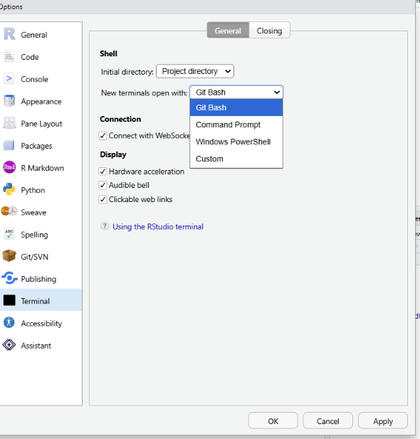

```{=html}
<style>
.h1,h2,h3 {
color:#2f1a61;
}

.subtitle, section.normal {
color:#291854;
}

.title {
color:#cc0065;
}

.orange-box {
  background: #fff3e6;
  border: 2px solid #e67e22;
  border-left-width: 7px;
  border-radius: 4px;
  color: #5c330d;
  margin: 1.25em 0;
  padding: 0.9em 1.1em;
}

.orange-box p:last-child {
  margin-bottom: 0;
}

</style>
```

```{r setup, include=FALSE}
knitr::opts_chunk$set(echo = TRUE, message = FALSE, warning = FALSE)
```

# Welcome to Week 4! 👋

Today we will work with the **command line interface** (CLI): a text-based way to interact with your computer. The program that reads and runs those commands is a **shell**. On macOS and Linux this will usually be `zsh` or `bash`; on Windows, we will use the RStudio Terminal configured with WSL or Git Bash.

The goal is not to memorise hundreds of commands. If this is the only command-line session you will ever take, you should leave able to:

- know where a command will run and move deliberately through folders;
- inspect files and search text safely;
- connect small commands with pipes and save their output;
- run a reproducible script, including an R script; and
- read a command suggested by an AI agent before approving it.

Throughout the lab, commands beginning with `$` are commands to type in the terminal. Do **not** type the `$`; it represents the prompt.

---

# 1. Setup 

Before we can start working with the shell, we need to make sure that our computers have one setup correctly. As we have seen in the lecture, there are many different shells. We will work with `bash`/`zsh`. They are very similar and belong to the same family of shells. These are also known as UNIX-style shells. Windows `powershell` and `cmd.exe` are examples for non-UNIX style shells. Especially due to Linux popularity on servers, UNIX-style shells kind of "won" and are more common in the wild. Good news is: **macOS and Linux will by default come with a UNIX-style shell!**. On macOS, open it by e.g., searching for "Terminal" via Spotlight.

If you are on **Windows**, the easiest way to get a UNIX-style bash environment is via your [git installation](https://gitforwindows.org/) that should come with "git bash". Open that by searching for it via the start menu (windows button).

:::orange-box
To ensure that our shell is integrated with RStudio in the best possible way, open `Tools > Global Options` and navigate to the "Terminal" section towards the bottom of the list. Check that new terminal are opened with "git bash".


:::

# 2. The shell is another console

RStudio already contains two command-line interfaces. In the **R Console**, you type R expressions and R evaluates them. In the **Terminal** tab, you type shell commands and the shell starts programs such as `ls`, `grep`, `git`, or `Rscript`.

Both consoles have a current **working directory**. This is the default location for relative file paths. In R, check it with `getwd()`; in a shell, check it with `pwd` (*print working directory*). A relative path such as `data/bird_notes.txt` only makes sense relative to that location.

Open RStudio's Terminal (Tools > Terminal > New Terminal or press Alt + Shift + R) and try:

```bash
$ pwd
$ whoami
$ echo "Hello from the shell"
```

`echo` prints its arguments. This tiny command is useful for checking that you understand quoting, variables, and redirection later on.

::: alert-info
**Exercise 1 — Locate yourself**

Run `pwd` in the Terminal and `getwd()` in the R Console. Are they the same? Why would a command using `data/file.csv` work in one place but fail in the other.
:::

## Getting help and recovering from mistakes

The shell is deliberately terse. When you meet an unfamiliar command, start with its manual page or built-in help:

```bash
$ man grep
$ grep --help
$ which Rscript
```

Press `q` to leave a `man` page. `which Rscript` asks the shell which executable it would run; this is especially helpful when you have more than one R installation.

[explainshell.com](https://explainshell.com/) is another great resource. The site makes the contents of manpages much easier to discover and more interactive. 

Use the up and down arrows to revisit earlier commands, `Tab` to complete paths, and `Ctrl`+`C` to stop a command currently running in the foreground. If you want to look up a command that you used a while ago, try reverse searching your shell-history with `Ctrl`+`R`.

Read errors from top to bottom: `No such file or directory` usually means that the current directory or a path is not what you thought it was.

# Be lazy, but right

The Unix philosophy is to build small programs that each do one job well, and to combine them when a task needs several steps (more on that later). For example, `grep` finds matching lines, `sort` puts them in order, and `uniq -c` counts repeated lines. Rather than one enormous program, the shell lets us connect these focused tools with pipes (`|`). This makes commands easier to inspect, test one step at a time, and reuse.

# Commands, arguments, and flags

Most shell commands follow the same broad pattern: 

```bash
command [flags] [arguments]
```

The command names the program, flags or options modify its behavior, and arguments tell it what to work on. For example:

```bash
grep -in "robin" data/bird_notes.txt
```
Here, `grep` is the command, `-i` means "ignore upper/lower case," and `-n` adds line numbers, `"robin"` and `data/bird_notes.txt` are arguments. 

Short flags usually begin with one dash (`-n`); longer, more readable flags often use two (`--help`). Short flags can be combined, so instead of supplying a command with `-c -i` you can also write `-ci`. Every command defines its own flags, so use command `--help` or man command rather than trying to memorise them.

---

# 3. Files, folders, and the working directory

For this lab, first move into the folder containing this file. Replace the example path with the path on *your* computer. If you are using an R Project, you will probably already be in the right place (nifty, right?) - check with `pwd` before navigating somewhere.

```bash
$ cd /path/to/ids_labs_26/04_command_line
$ pwd
$ ls
```

`cd` changes directory and `ls` lists its contents. Some useful variations are:

| Command | Meaning |
|:--|:--|
| `ls -la` | list all entries, including hidden files, with details |
| `cd data` | move into the `data` subfolder |
| `cd ..` | move one folder up |
| `cd ~` | move to your home folder |
| `mkdir results` | create a folder called `results` |
| `touch notes.txt` | create an empty file (or update its timestamp) |
| `cp source.txt copy.txt` | copy a file |
| `mv old.txt new.txt` | move or rename a file |

Paths that begin with `/` (or a drive/mount point on Windows) are **absolute**: they identify one exact location. Paths without that beginning are **relative** to `pwd`. A dot (`.`) means "this folder"; two dots (`..`) mean its parent.

Before using a command that changes files, inspect the target first with `pwd` and `ls`. In particular, `rm` deletes files rather than moving them to a recycle bin; leave it out of exploratory commands until you are completely sure about the path.

::: alert-info
**Exercise 2 — Navigate deliberately**

1. From the lab folder, list the contents of `data` without changing directories.
2. Change into `data`, verify it with `pwd`, then return to the lab folder using `cd ..`.
3. Create a folder called `scratch`, inspect it, and remove it again. First, try doing that with `rm`. What happens? Now, try with `rmdir scratch`. Why is `rmdir` safer than a recursive delete for this exercise?
:::

---

# 4. Reading and searching text

Many data formats are plain text: CSV, TSV, logs, JSON, source code, and Markdown. The shell is excellent for looking at these files without opening a spreadsheet or writing a complete R script.

Our small dataset, `data/bird_notes.txt`, contains field notes. First preview it:

```bash
$ head data/bird_notes.txt
$ tail -n 3 data/bird_notes.txt
$ wc -l data/bird_notes.txt
```

`head` and `tail` show the beginning and end; `wc -l` counts lines. For a long file, use `less data/bird_notes.txt`, scroll with the arrows or Space, search with `/word`, and press `q` to quit.

## `grep`: find lines that match a pattern

`grep` prints lines containing a pattern. Start with a literal search:

```bash
$ grep "sparrow" data/bird_notes.txt
$ grep -n "sparrow" data/bird_notes.txt
$ grep -i "sparrow" data/bird_notes.txt
```

`-n` adds line numbers and `-i` ignores case. Quote patterns with spaces or punctuation so that the shell passes them to `grep` as one argument. The pattern language is regular expressions (regex): a compact way to describe text. You do not need to become a regex expert today, but these three patterns are worth recognising:

```bash
$ grep '^2026-09' data/bird_notes.txt   # lines beginning with a September date
$ grep 'rain$' data/bird_notes.txt     # lines ending in rain
$ grep -E 'sparrow|robin' data/bird_notes.txt  # either word
```

Here `^` means "start of line", `$` means "end of line", and `|` means "or" when `-E` enables extended regular expressions. Use `grep -v` to keep *non-matching* lines, and `grep -c` to count matching lines rather than print them.

:::orange-box
You might have seen regex already in the context of `R` code (`str_detect`...) or in other programming languages. While the general idea of regular expressions is similar across all programming languages/tools, the same expression might look different across different "flavors". `grep` uses a flavor called POSIX regex. To debug/learn more about regular expressions, check out [regex101.com](https://regex101.com/). 
:::

::: alert-info
**Exercise 3 — Ask questions of a text file**

Using `data/bird_notes.txt`, write commands to:

1. show all lines mentioning `robin`, regardless of case, with line numbers;
2. count notes containing `rain`; and
3. show notes that do **not** contain the word `heard`.
:::

---

# 5. Redirecting output and building pipelines

Every command has an input stream and an output stream. A **pipe** (`|`) sends the output of the command on its left to the input of the command on its right. **This resembles R's `|>`: each step receives the result of the previous one.**

For example, this pipeline searches, sorts, counts duplicates, and sorts the resulting counts numerically:

```bash
$ grep -i -o -E 'sparrow|robin|blackbird' data/bird_notes.txt | sort | uniq -c | sort -nr
```

Read it from left to right: extract each bird name (`grep -o`), put equal names beside one another (`sort`), count adjacent duplicates (`uniq -c`), then order the counts (`sort -nr`). A good debugging habit is to run the pipeline one piece at a time before combining it.

`>` redirects standard output into a file, creating the file or replacing its contents. `>>` appends instead. Redirect the final pipeline output into a new, deliberately named results file:

```bash
$ mkdir -p results
$ grep -i -o -E 'sparrow|robin|blackbird' data/bird_notes.txt | sort | uniq -c | sort -nr > results/bird-counts.txt
$ cat results/bird-counts.txt
```

:::orange-box
`cat` can be used to concatenate files - but you will probably mostly use it to quickly print a file to the shell, to inspect it's contents.
:::

Be careful with `>`: it overwrites an existing file silently. Confirm the working directory and target path first. `tee` is useful when you want to see output *and* save it:

```bash
$ grep -i 'rain' data/bird_notes.txt | tee results/rain-notes.txt
```

::: alert-info
**Exercise 4 — A reproducible text summary**

Create `results/weather-counts.txt` containing the counts for `sun`, `cloud`, and `rain` in the field notes. Use a pipeline and inspect the result. What would change if you used `>>` instead of `>` and ran the command twice?
:::

---

# 6. Shell variables and the environment

Like R, the shell can save values under names. In a shell, these are called **variables**. Most often, they hold text such as a filename or folder path.

```bash
$ bird="robin"
$ echo "$bird"
robin
```

There must be **no spaces** around `=`. To use a variable’s value, put `$` before its name. Quoting the expansion —`"$bird"` rather than `$bird`— is a good habit: it keeps a value containing spaces together as one argument.

Variables make commands easier to read and update. Compare:

```bash
$ grep -i "robin" data/bird_notes.txt > results/robin-notes.txt
```

with:

```bash
$ bird="robin"
$ input="data/bird_notes.txt"
$ output="results/robin-notes.txt"

$ grep -i "$bird" "$input" > "$output"
```

The second version has more setup, but changing the bird, input, or output only requires changing it in one place.

## Environment variables

An **environment variable** is a shell variable that is passed on to programs started from that shell. You probably have already encountered one important example: `PATH`.

```bash
$ echo "$PATH"
$ which Rscript
```

`PATH` is a list of folders in which the shell looks for programs. When you type `Rscript`, the shell searches those folders until it finds an executable with that name. This is why a program may work in RStudio but produce `command not found` in another terminal: the two sessions may have different `PATH` settings.

Other useful environment variables include `$HOME`, your home folder, and `$SHELL`, the shell program currently in use. You can make a variable available to programs started from the current shell with `export`:

```bash
$ export PROJECT_NAME="bird-notes"
```
:::orange-box
For this lab, we will mainly use ordinary shell variables. However, environment variables are important to know about: **Do not put passwords or API keys directly into scripts**; instead environment variables are usually one possible option.
:::

---

# 7. From commands to a script

Commands you expect to reuse belong in a script. A shell script is a plain-text file containing commands; it documents the workflow and makes it repeatable - the idea is exactly the same as with a `.R` script that you save to keep it around. Open `scripts/make_report.sh` in RStudio and read it before running it.

```bash
$ bash scripts/make_report.sh
$ ls results
$ cat results/bird-counts.txt
$ cat results/bird-summary.csv
```

The script starts with `#!/usr/bin/env bash`, called a *shebang*. It declares that the script is written for Bash. We run it explicitly with `bash` today, which avoids needing to change file permissions. Notice the following best-practices:

- `set -euo pipefail` stops the script when a command fails, an unset variable is used, or a pipeline fails;
- it works from the project root, rather than relying on whatever folder the Terminal happened to open in; and
- it creates only the `results` folder and overwrites only named outputs there.

:::orange-box
For this part of the lab session, try to focus more on fundamentals and concepts - the goal here is not to remember or even understand each and every shell command we throw at you, but more **why** we would even think about some things.
:::

The final command, `Rscript scripts/make_summary.R ...`, runs R without opening the RStudio interface. Arguments after the script name are available inside R as `commandArgs(trailingOnly = TRUE)`. This is a useful bridge: the shell can organise files and lightweight text tasks, while R can handle richer data transformation and statistical work.

Try running the R part directly:

```bash
    $ Rscript scripts/make_summary.R data/bird_notes.txt results/bird-summary.csv
```

::: alert-info
**Exercise 5 — Make a useful script change**

1. Read `scripts/make_report.sh` and identify every output it writes.
2. Add one `echo` line that tells a future reader what the script is about to do.
3. Run the script again. Change one input path to a deliberately wrong path, run it, read the error, then restore the correct path.

Optional: change the list of birds in the `grep` pattern and rerun the report.
:::

---

# 8. The CLI in the age of AI agents

The command line matters more, not less, now that coding agents can work in a project. Tools such as Codex, Claude Code, and Gemini CLI use the shell to inspect folders, search code with `grep`, run tests, install packages, and execute scripts. They can write useful commands faster than anyone in the room - but they can also wipe your entire submission one minute before the deadline.

Reading a shell command is therefore a necessary supervision skill when you want to properly work with AI assistants (and no - copy-pasting code into ChatGPT does not count). Before approving an agent-proposed command, ask:

1. **Where will it run?** Check `pwd` and resolve relative paths.
2. **What will it touch?** Look carefully at paths and wildcards such as `*`.
3. **Does it overwrite, delete, install, or send data anywhere?** Treat `>`, `mv`, `rm`, package installers, and network commands with special care.
4. **Can I inspect first?** Prefer `ls`, `head`, `git diff`, or a dry run before a large change.

For example, `grep -R "TODO" .` is a read-only search inside the current project. By contrast, `rm -rf results/*` has a very different effect, and could be disastrous in the wrong working directory.

::: alert-info
**Final reflection**

Imagine an AI agent proposes a command that writes a report into `results/`. What checks would you perform before approving it? How could `pwd`, `ls`, and a careful search for `>` help?
:::

---

# Key takeaways

- The shell, like R, has a working directory: use `pwd` before relying on relative paths.
- `ls`, `cd`, `head`, `less`, `grep`, `wc`, `sort`, and `uniq` let you inspect and combine text data quickly.
- Pipes (`|`) pass output forward; `>` saves output but overwrites, while `>>` appends.
- Scripts turn a sequence of commands into a readable, repeatable workflow. `Rscript` lets that workflow call R.
- You do not need to memorise commands. You do need to read them, understand their paths and side effects, and know how to get help.

## Further practice

- [Software Carpentry: The Unix Shell](https://swcarpentry.github.io/shell-novice/)
- [Effective Shell](https://effective-shell.com/)
- [explainshell](https://explainshell.com/) for decoding shell command options

---

This script was drafted by [Linus Hagemann](https://linushagemann.de). Large parts of the material were originally generated with GPT-5.6, based on the accompanying [lecture slides by Simon Munzert](https://github.com/intro-to-data-science-26/lectures/tree/main/04_command-line).

